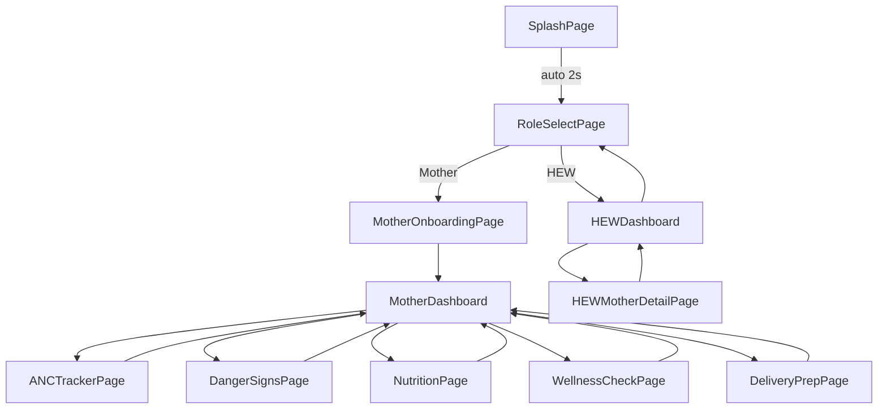
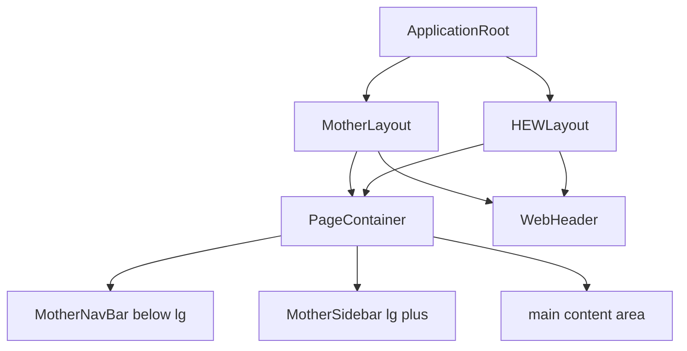
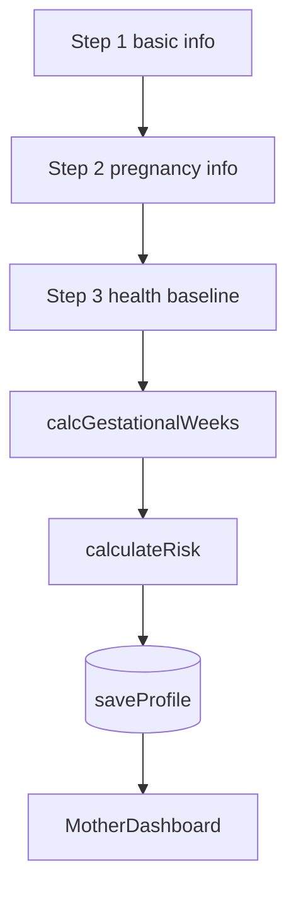
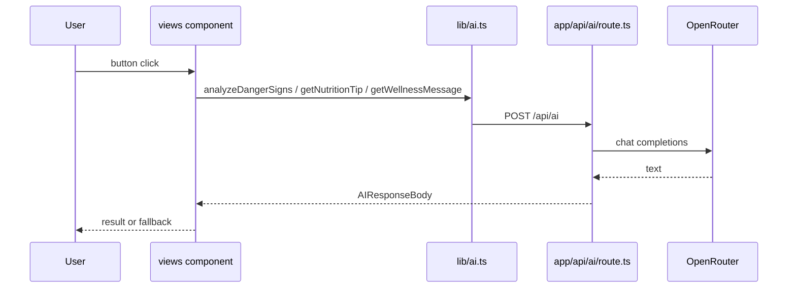
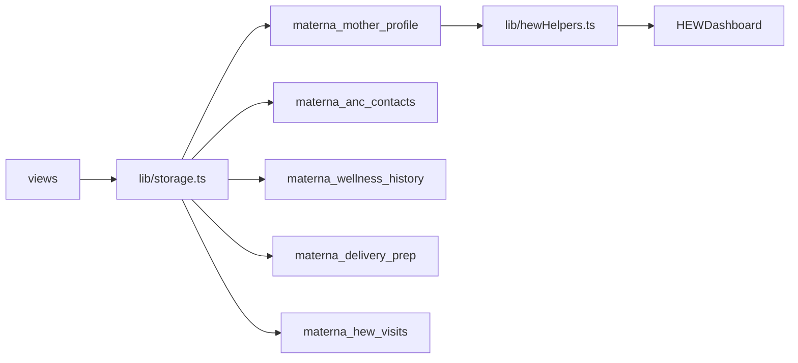
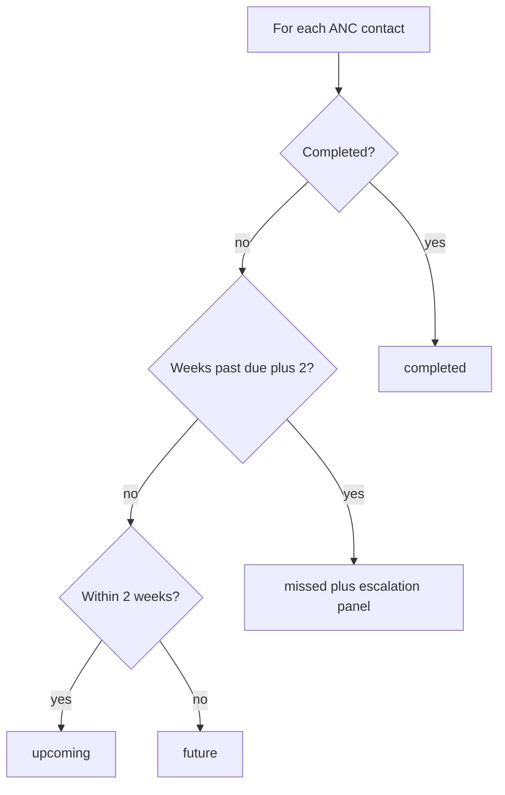
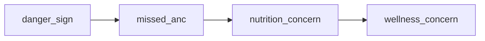
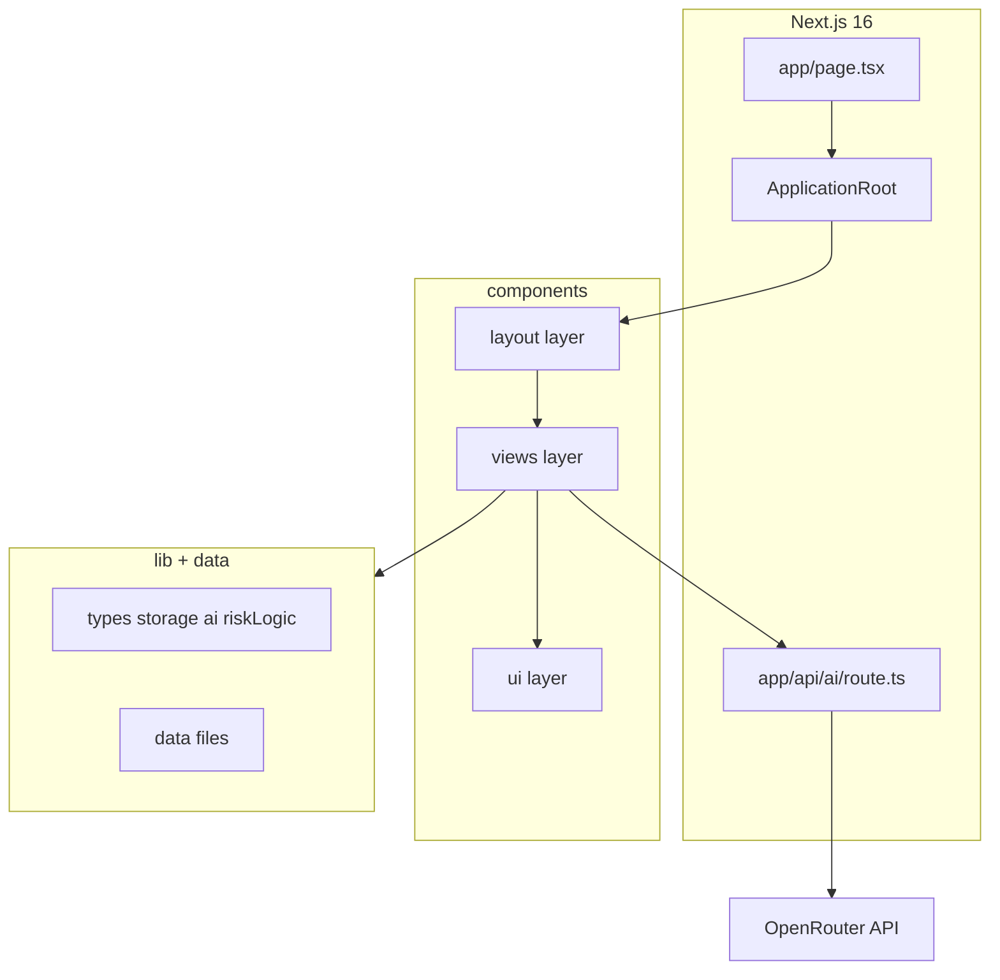

# MaternaAI — Application Workflow

Mermaid diagrams for the current web implementation. See [prompt.md](./prompt.md) for file paths and [README.md](./README.md) for feature status.

---

## 1. View navigation (`ApplicationRoot`)

Client-side routing via `AppView` state — no per-feature URL routes at MVP.

---

## 2. Layout composition

---

## 3. Mother registration and risk

---

## 4. AI request flow

---

## 5. Storage

---

## 6. ANC status logic

---

## 7. HEW priority sort

---

## 8. Architecture

